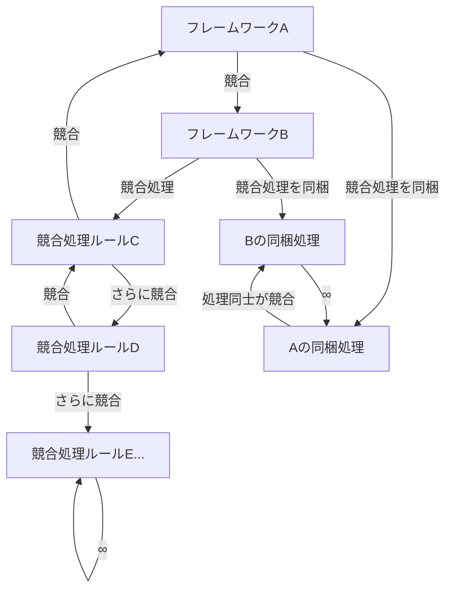

## 3. 各原則の詳細

### 3.1 不滅性

不滅性は本法則の最も基礎的な原則であり、法則全体の土台を構成する。

いかなるシステムにおいても、複雑性を排除する操作は、複雑性を別の場所に移転させる操作と等価である。あるフレームワークの導入によって対象領域の複雑性が低減したように見える場合、その低減分に相当する（あるいはそれ以上の）複雑性が、フレームワーク自体の構造、運用ルール、検証プロセス、または管理体制のいずれかに移転している。

これは熱力学におけるエネルギー保存則との構造的類似性を持つ。エネルギーが形態を変えて保存されるように、複雑性もまた形態を変えて系内に保存される。ただし、エネルギー保存則と異なり、複雑性の総量を定量的に測定する手段は確立されていないため、厳密な等量保存を主張するものではない。観測される現象は「複雑性の非消滅」である。なお、本法則自体の定式化もまた不滅性の適用対象であり、法則の記述に伴う複雑性が本資料の構造・用語・図表に移転している。

### 3.2 自己言及性

自己言及性は、フレームワークの検証における原理的限界を記述する。

あらゆるフレームワークは、自身の妥当性を自身の内部から完全に検証することができない。フレームワークAの妥当性を検証するためにはフレームワークAの外部に立つ必要があるが、外部に立った時点で別のフレームワークBの内部に立っていることになり、フレームワークBの妥当性は検証されていない。

この構造はゲーデルの第二不完全性定理が示す「十分に強力な形式体系は、自身の無矛盾性を自身の内部で証明できない」という制約と同型である。

本原則自身もまた自己言及構造を持つ。「自己言及すると矛盾する」という記述自体が自己言及パラドックス（自分自身に言及することで生じる論理的矛盾）の一形態であり、本原則は自身の主張を自身の存在によって例証している。

### 3.3 観測起爆性

観測起爆性は、本法則に固有の特異な性質を記述する。

本法則の内部構造を理解・分析・定式化しようとする行為は、それ自体が複雑性を生成する活動であり、本法則の作用を発動させる起爆剤として機能する。したがって、本法則は観測されることなしには存在を認知されないが、観測された瞬間に観測者を法則の作用範囲内に巻き込む。

これにより以下の二律背反が生じる。本法則を知るためには観測が必要である。観測は法則の発動を伴う。法則の発動は観測者に対して複雑性を生成する。したがって、本法則の認知と被影響は不可分である。

本法則を知らない者は法則の作用を認識できないが、複雑性の移転自体は認知の有無に関わらず発生し得る。ただし、法則を認知しない限り、複雑性の移転先を意識的に選択するという恩恵は得られない。本法則は「知ることによってのみ有効化される防御機構」であり、同時に「知ることによって必ず発動する作用機構」である。

### 3.4 簡素化抵抗性

簡素化抵抗性は、複雑性に対する最も直感的な対処法が無効化される機構を記述する。

システムの複雑性を低減するための最も一般的なアプローチは簡素化である。オッカムの剃刀に代表される「不必要な複雑性を除去せよ」という原則は広く受容されている。しかし、簡素化の実行には不可避的に伴う工程がある。

何が「不必要」であるかの判定基準の定義。判定基準に基づく各要素の要否判定。除去後のシステムの妥当性検証。これらの工程はそれぞれ独立した複雑性を持ち、簡素化によって除去された複雑性を相殺する、あるいは上回る複雑性を系内に導入する。

特に「シンプルとは何か」の定義自体が高度に複雑な問題であり、その定義を簡素化しようとすると再帰的に同じ構造が出現する。簡素化抵抗性は、簡素化の試みが本法則を弱体化させるのではなく強化するという逆説的な機構を記述している。

### 3.5 無限後退性

無限後退性は、フレームワーク間の競合処理における原理的な非終端性を記述する。

複数のフレームワークが同一の対象に対して適用された場合、フレームワーク間で判断の競合（バッティング）が発生し得る。この競合を解決するためのバッティング処理には競合処理ルールが必要であるが、この競合処理ルール自体がひとつのメタフレームワーク（フレームワークを管理するための上位フレームワーク）として機能する。

競合処理フレームワークが元のフレームワークと競合した場合、さらに上位の競合処理フレームワークが必要となり、この連鎖は原理的に終端しない。

各フレームワークに競合処理を同梱するアプローチにおいても、同梱された競合処理同士の競合が発生するため、問題は解消されず形態を変えて保存される。これは不滅性の具体的な発現形態のひとつである。

### 3.6 分割増殖性

分割増殖性は、モジュラー設計アプローチの限界を記述する。

フレームワークの複雑性を管理するための一般的なアプローチとして、フレームワークを小さなモジュールに分割し、必要なモジュールのみを組み合わせて使用するモジュラーフレームワーク（モジュラー設計）がある。

理論上、モジュラー設計は影響範囲の限定と柔軟な組み合わせを両立させる。しかし現実には、モジュール数nに対して以下の複雑性が発生する。

モジュール間の互換性検証はモジュールの組み合わせ数に応じて増大し、その規模は最大で2のn乗に達し得る。各モジュール間のインターフェース定義が必要となり、このインターフェース定義自体がひとつのフレームワークとして複雑性を持つ。モジュールのバージョン管理、依存関係管理、互換性マトリクス（組み合わせ検証済みマトリクス）の維持が運用コストとして加算される。

結果として、モジュラー分割によって個々のモジュールの複雑性は低減するが、モジュール間の関係性という新たな次元の複雑性が導入され、系全体の複雑性は保存または増大する。本資料における8原則への分割自体がこの原則の適用対象であり、原則数の増大圧力として観測されている。

### 3.7 文脈依存性

文脈依存性は、フレームワーク検証における文脈（コンテキスト）の不可欠性を記述する。

フレームワークは特定の文脈において機能するよう設計され、その要件定義（フレームワークが満たすべき条件の記述）もまた特定の文脈を前提としている。しかし、フレームワークの検証はしばしば文脈を捨象した状態で行われる。文脈なしの検証で確認できるのは論理的整合性のみであり、フレームワーク強度（実用的な強度）、すなわち現実の問題に対する有効性は検証できない。

実用的な検証にはサンドボックス（本番に近いが安全に失敗できる環境）の構築が必要であるが、抽象的なフレームワークほどサンドボックスの構築が困難になる。ソフトウェアフレームワークにはテスト環境を構築できるが、思考フレームワークのテスト環境とは何かという問いに対する明確な回答は存在しない。

さらに、あるフレームワークがどの文脈で有効であるかを記述するためには、文脈の分類体系が必要となるが、この分類体系自体がひとつのフレームワークであり、その検証にはさらに別の文脈が必要となる。

本法則自体もまた、どのような文脈で適用されるべきかが明示的に定義されておらず、本原則の適用対象となっている。

### 3.8 汎用自殺性

汎用自殺性は、フレームワークの適用範囲と有効性の間に存在するトレードオフの極限的帰結を記述する。

フレームワークの適用範囲を限定するほど、その範囲内での有効性（強度）は高まる。逆に、適用範囲を拡大するほど、個別の文脈への適合度は低下する。この関係を極限まで推し進めると以下の二つの終端状態に到達する。

完全限定（適用範囲を最小化）の場合、特定の一状況にのみ完璧に適合するが、それ以外の状況には一切適用できず、フレームワークとしての汎用的価値を喪失する。完全汎用（適用範囲を最大化）の場合、あらゆる状況に適用可能と主張するが、個別の状況に対する有効な指針を何も提供できず、フレームワークとしての実用的価値を喪失する。

いずれの終端状態においてもフレームワークは機能的に死亡する。汎用性を高める行為が汎用性自体を毀損するこの構造を、本法則では汎用自殺性と呼称する。

本法則自体も「あらゆるフレームワークに適用可能」と主張した瞬間に本原則の適用対象となり、その主張自体の有効性が毀損される。

---
