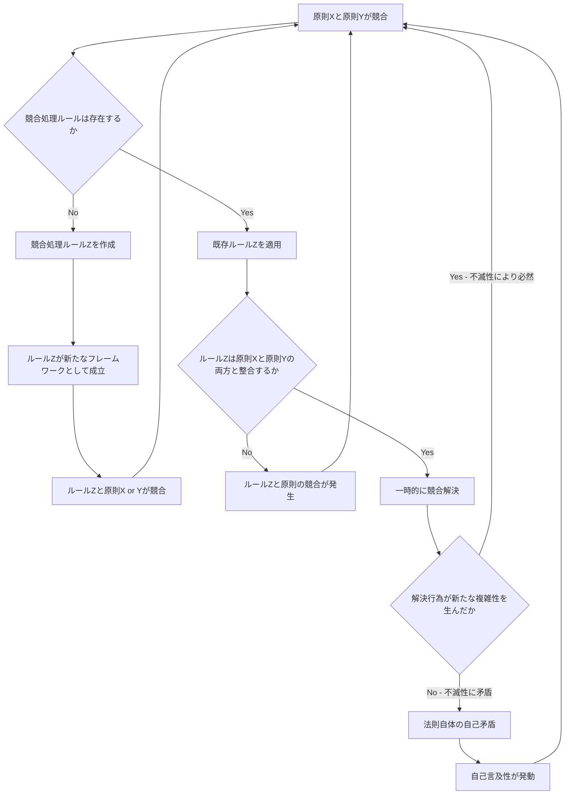

## 4. 原則間の関係構造

### 4.1 原則間の依存関係

8原則は独立して存在するのではなく、相互に依存・強化・競合する関係にある。以下に主要な関係を示す。

#### 原則間の依存関係表

|起点|関係|終点|
|---|---|---|
|1. 不滅性|基礎|2. 自己言及性|
|1. 不滅性|基礎|3. 観測起爆性|
|1. 不滅性|基礎|4. 簡素化抵抗性|
|1. 不滅性|具体化|5. 無限後退性|
|1. 不滅性|具体化|6. 分割増殖性|
|2. 自己言及性|前提|3. 観測起爆性|
|2. 自己言及性|強化|5. 無限後退性|
|4. 簡素化抵抗性|相互強化|1. 不滅性|
|6. 分割増殖性|競合|4. 簡素化抵抗性|
|7. 文脈依存性|制約|1. 不滅性|
|7. 文脈依存性|制約|8. 汎用自殺性|
|8. 汎用自殺性|強化|7. 文脈依存性|
|5. 無限後退性|発動|6. 分割増殖性|

#### 関係の類型

|関係タイプ|意味|該当数|
|---|---|---|
|基礎|当該原則の成立前提となる|3|
|具体化|上位原則の具体的な発現形態である|2|
|前提|当該原則の理解に先行して必要である|1|
|強化|当該原則の作用を増幅する|2|
|相互強化|双方向に作用を増幅し合う|1|
|競合|原則同士が矛盾・衝突する|1|
|制約|当該原則の適用範囲を限定する|2|
|発動|当該原則の作用が他の原則をトリガーする|1|

不滅性（原則1）はすべての原則の基礎として機能し、他の原則は不滅性の具体的な発現形態または強化機構として位置づけられる。簡素化抵抗性（原則4）は不滅性を相互に強化する関係にあり、文脈依存性（原則7）と汎用自殺性（原則8）は互いに制約・強化する循環構造を形成している。

なお、本関係表自体が原則間の関係を分割・整理する行為であり、分割増殖性（原則6）の適用対象である。

### 4.2 バッティング発生フロー

原則間で競合が発生した場合の処理フローを以下に示す。なお、本フロー自体が無限後退性（原則5）の適用対象であり、終端しないことに留意されたい。

上記フローにおいて、すべての経路は最終的にSTARTに回帰する。唯一の例外として想定される「複雑性を生まない解決」は不滅性と矛盾するため、自己言及性を経由して再びループに合流する。このフローが終端しないこと自体が、無限後退性の図示的証明となっている。

---
