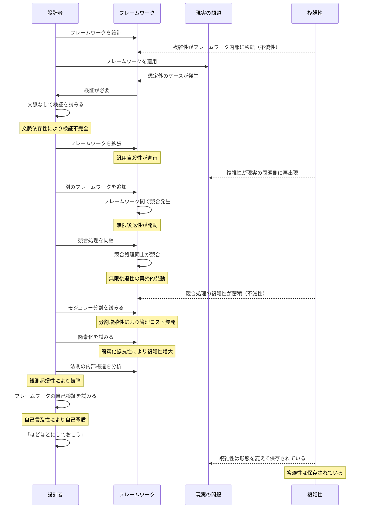

## 5. フレームワーク適用時の崩壊シーケンス

以下に、あるフレームワークが設計から自壊に至るまでの典型的なシーケンスを示す。

```mermaid
sequenceDiagram
    participant D as 設計者
    participant F as フレームワーク
    participant R as 現実の問題
    participant C as 複雑性

    D->>F: フレームワークを設計
    C-->>F: 複雑性がフレームワーク内部に移転（不滅性）
    D->>R: フレームワークを適用
    R->>F: 想定外のケースが発生
    F->>D: 検証が必要
    D->>D: 文脈なしで検証を試みる
    Note over D: 文脈依存性により検証不完全
    D->>F: フレームワークを拡張
    Note over F: 汎用自殺性が進行
    C-->>R: 複雑性が現実の問題側に再出現
    D->>F: 別のフレームワークを追加
    F->>F: フレームワーク間で競合発生
    Note over F: 無限後退性が発動
    D->>F: 競合処理を同梱
    F->>F: 競合処理同士が競合
    Note over F: 無限後退性の再帰的発動
    C-->>F: 競合処理の複雑性が蓄積（不滅性）
    D->>F: モジュラー分割を試みる
    Note over F: 分割増殖性により管理コスト爆発
    D->>F: 簡素化を試みる
    Note over F: 簡素化抵抗性により複雑性増大
    D->>F: 法則の内部構造を分析
    Note over D: 観測起爆性により被弾
    D->>D: フレームワークの自己検証を試みる
    Note over D: 自己言及性により自己矛盾
    D->>D: 「ほどほどにしておこう」
    C-->>R: 複雑性は形態を変えて保存されている
    Note over C: 複雑性は保存されている
```

このシーケンスにおいて、設計者のあらゆる対処行為が8原則のいずれかを発動させ、最終的に設計者は合理的な撤退（「ほどほどにしておこう」）を選択する。これは敗北ではなく、複雑性保存の法則に対する現実的な共存戦略として解釈されるべきである。

---
